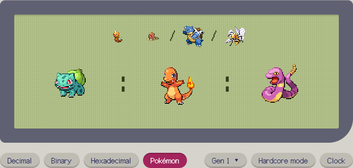

# Pokémon Numerals

What if numbers were Pokémon? **[Try it →](https://zeikar.dev/pokemon-numerals/)**



In Pokémon Numerals, an integer *n* is written as the Pokémon whose National Pokédex number is *n*. Zero is MissingNo., and anything above the last Pokédex number is written positionally in base (last number + 1).

The demo shows a clock, today's date, and a converter, with Decimal, Binary and Hexadecimal alongside for comparison. Hover or tap a sprite to see its Pokédex number and name. Pick an earlier generation to count in its smaller base. Hardcore mode shows only silhouettes.

## Run locally

No build step. Serve the folder with any static server:

```sh
python3 -m http.server
```

Then open http://localhost:8000.

## Development

```sh
npm test       # numeral conversion tests (Node's built-in test runner)
npm run data   # regenerate data/pokemon.json from PokéAPI
```

Rerun `npm run data` when a new generation is released. The numeral base grows with it.

## Deploy

GitHub Pages: Settings → Pages → Deploy from a branch → `main` / root.

## Credits

Pokémon names and sprites come from [PokéAPI](https://pokeapi.co/). This is an unofficial fan project, not affiliated with Nintendo, Creatures, GAME FREAK or The Pokémon Company.
